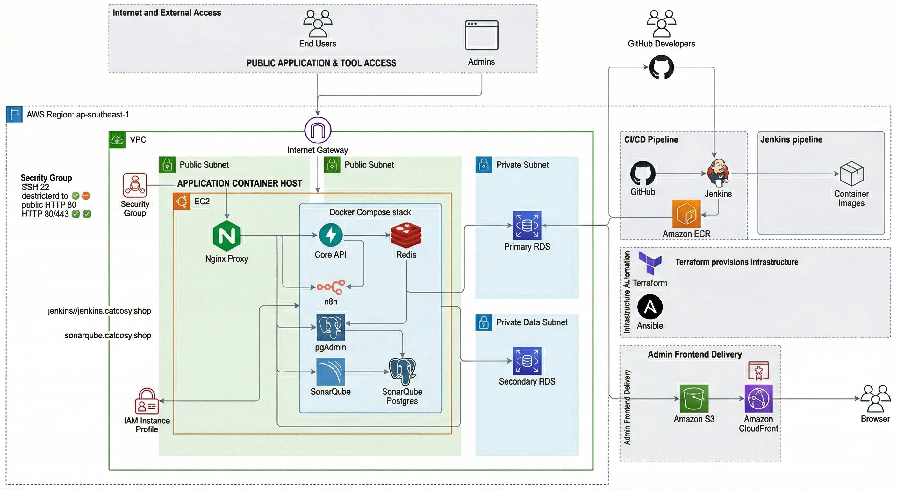
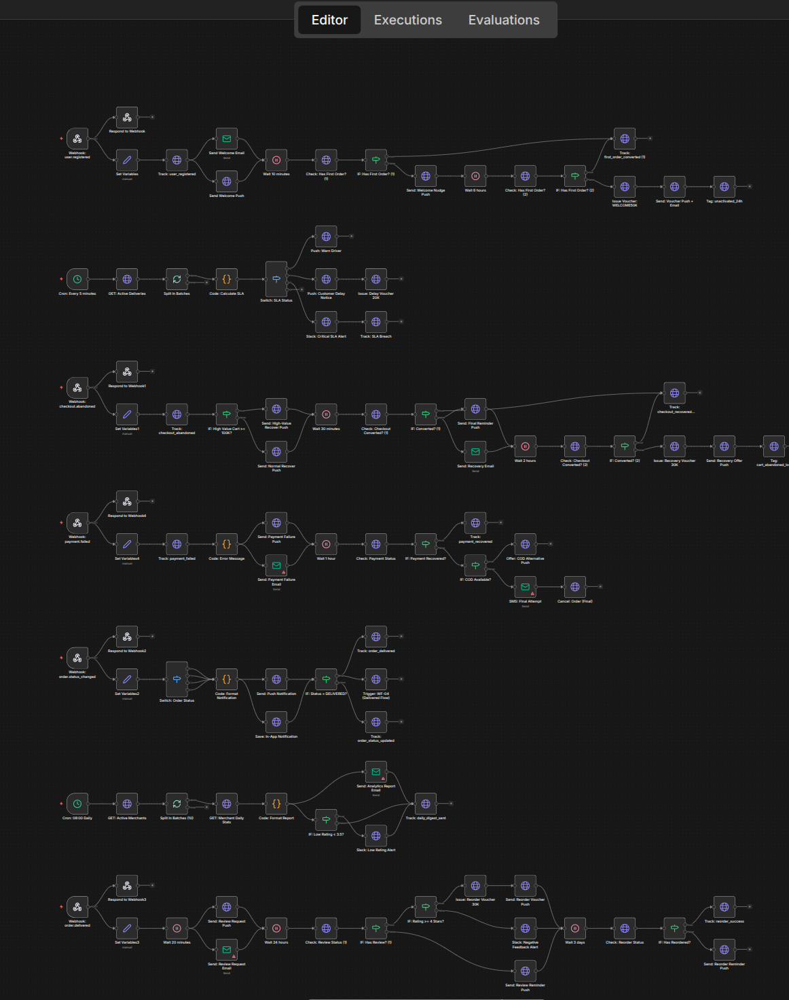

# Customer Journey Infrastructure & n8n Workflows

Infrastructure and automation workspace for the Bitenex customer journey platform.

This repository is primarily organized around:

- infrastructure definitions in `infra/`
- automation workflows and operating docs in `docs/n8n/`

It should be read as an operations and deployment repository, not as an application README.

## Overview

<p align="center">
  
</p>

The platform is split into four practical layers:

- **Access layer**: end users, admins, and public entry points.
- **Application host layer**: an EC2-based Docker Compose host running operational services such as Nginx, n8n, Redis, pgAdmin, and Jenkins.
- **Data layer**: persistent services isolated in private subnets, centered around RDS.
- **Delivery layer**: Terraform and Ansible for infrastructure lifecycle, with GitHub, Jenkins, ECR, S3, and CloudFront handling CI/CD and frontend delivery.

## Repository Layout

```text
customer-journey/
├── assets/architecture.png
├── assets/workflow.png
├── docs/n8n/
├── docs/phase-1/
├── infra/aws/
└── infra/docker-compose/
```

## What This Repository Covers

### Infrastructure

- Local and development service orchestration with Docker Compose
- AWS provisioning with Terraform
- Host bootstrap and deployment automation with Ansible
- Supporting operational services such as n8n, Redis, PostgreSQL, ClickHouse, pgAdmin, and Jenkins

### Automation

- Importable n8n workflow JSON files
- Workflow documentation with triggers, intent, and execution flow
- A reusable baseline for lifecycle messaging, recovery flows, SLA monitoring, and merchant reporting

## Infrastructure

### Local Stack

The local stack is defined in [`infra/docker-compose/docker-compose.yml`](./infra/docker-compose/docker-compose.yml).

Included services:

- `redis`
- `postgres`
- `clickhouse` via the `optional` profile
- `n8n`
- `burndown-render`

Start the stack:

```bash
docker compose -f infra/docker-compose/docker-compose.yml up -d
```

Common ports:

- `5678` for n8n
- `5432` for PostgreSQL
- `6379` for Redis
- `8123` and `9000` for ClickHouse
- `8088` for burndown-render

Example environment values:

```bash
POSTGRES_DB=cj
POSTGRES_USER=app
POSTGRES_PASSWORD=app
CLICKHOUSE_DB=cj
CLICKHOUSE_USER=default
CLICKHOUSE_PASSWORD=
N8N_BASIC_AUTH_ACTIVE=true
N8N_BASIC_AUTH_USER=admin
N8N_BASIC_AUTH_PASSWORD=admin
N8N_HOST=localhost
N8N_PROTOCOL=http
N8N_WEBHOOK_URL=http://localhost:5678
N8N_TIMEZONE=Asia/Ho_Chi_Minh
N8N_BLOCK_ENV_ACCESS_IN_NODE=false
BITENEX_API_BASE_URL=https://api.bitenex.vn
BITENEX_INTERNAL_API_KEY=change-me
```

### AWS Blueprint

The AWS deployment blueprint lives in [`infra/aws/`](./infra/aws/).

Core design:

- VPC in `ap-southeast-1`
- public subnets for the application container host
- private subnets for the data tier
- EC2 host for Docker Compose workloads
- Nginx as the public reverse proxy
- RDS as the managed database layer
- S3 and CloudFront for admin frontend delivery
- GitHub, Jenkins, and Amazon ECR for CI/CD

Terraform quick start:

```bash
cd infra/aws/terraform
cp terraform.tfvars.example terraform.tfvars
terraform init
terraform plan
terraform apply
```

Ansible bootstrap:

```bash
cd infra/aws/ansible
ansible-playbook -i inventory/aws_ec2.yml playbooks/bootstrap.yml
```

For deployment details, see [`infra/aws/README.md`](./infra/aws/README.md).

## n8n Workflows

The workflow library is stored in [`docs/n8n/`](./docs/n8n/).

<p align="center">
  
</p>

Primary references:

- [`docs/n8n/README.md`](./docs/n8n/README.md) for import and environment setup
- [`docs/n8n/WORKFLOWS.md`](./docs/n8n/WORKFLOWS.md) for detailed workflow behavior and diagrams

Included workflow set:

| Workflow | File | Trigger | Purpose |
|---|---|---|---|
| WF-01 | `WF-01-onboarding-first-order.json` | `user.registered` | Convert new users to a first order |
| WF-02 | `WF-02-abandoned-checkout-recovery.json` | `checkout.abandoned` | Recover abandoned checkout sessions |
| WF-03 | `WF-03-order-lifecycle-orchestration.json` | `order.status_changed` | Orchestrate order lifecycle notifications |
| WF-04 | `WF-04-delivered-review-reorder.json` | `order.delivered` | Request reviews and drive reorder behavior |
| WF-05 | `WF-05-driver-sla-monitor.json` | `*/5 * * * *` | Monitor driver SLA and delivery delays |
| WF-06 | `WF-06-payment-failure-recovery.json` | `payment.failed` | Recover failed payment flows |
| WF-07 | `WF-07-merchant-daily-analytics.json` | `0 8 * * *` | Send daily merchant analytics digests |
| WF-08 | `WF-08-winback-lapsed-users.json` | `0 10 * * *` | Re-engage inactive users |

### Importing Workflows into n8n

1. Start the local stack so n8n is available.
2. Open `http://localhost:5678`.
3. Import any JSON file from `docs/n8n/`.
4. Configure credentials and environment variables.
5. Validate the intended logic against `WORKFLOWS.md` before enabling production usage.

Common workflow environment variables:

```bash
BITENEX_API_BASE_URL=https://api.bitenex.vn
BITENEX_INTERNAL_API_KEY=your-internal-key
BITENEX_SLACK_WEBHOOK_URL=https://hooks.slack.com/services/xxx
SMTP_HOST=smtp.sendgrid.net
SMTP_PORT=587
SMTP_USER=apikey
SMTP_PASS=SG.xxxxx
```

## Recommended Reading Order

1. [`assets/architecture.png`](./assets/architecture.png)
2. [`assets/workflow.png`](./assets/workflow.png)
3. [`infra/aws/README.md`](./infra/aws/README.md)
4. [`infra/docker-compose/docker-compose.yml`](./infra/docker-compose/docker-compose.yml)
5. [`docs/n8n/README.md`](./docs/n8n/README.md)
6. [`docs/n8n/WORKFLOWS.md`](./docs/n8n/WORKFLOWS.md)

## Notes

- This README intentionally focuses on infrastructure and automation.
- For earlier product and domain context, see [`docs/phase-1/`](./docs/phase-1/).
