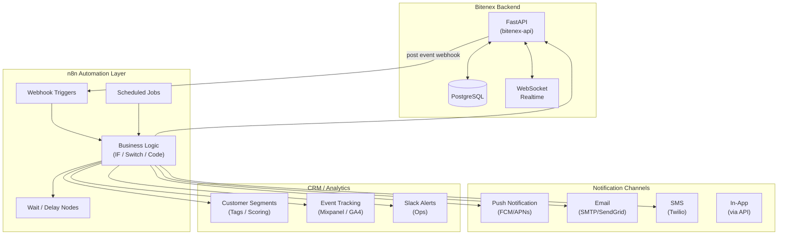
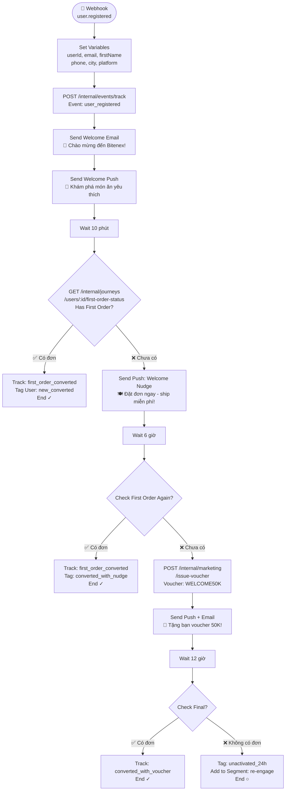
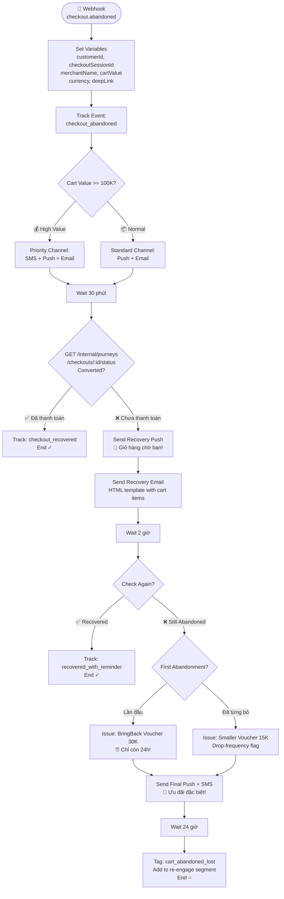
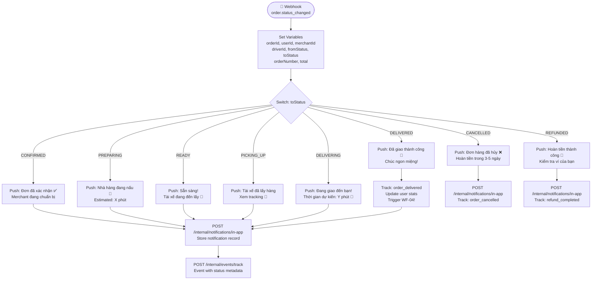
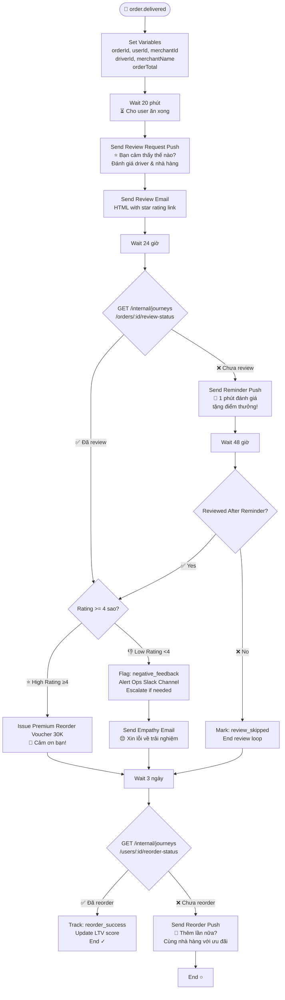
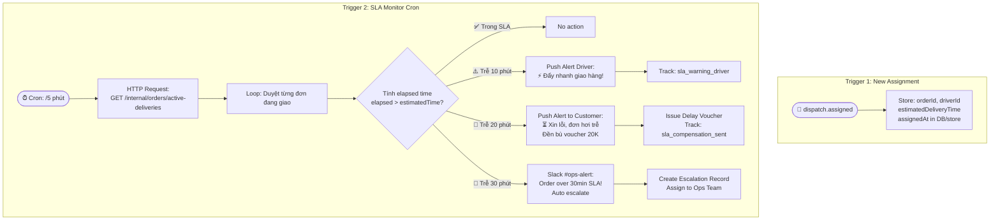
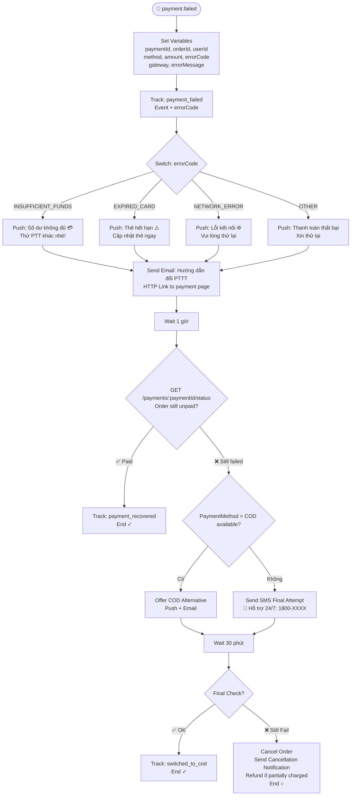
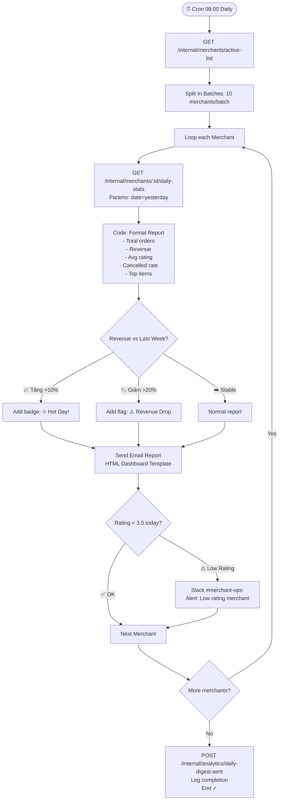
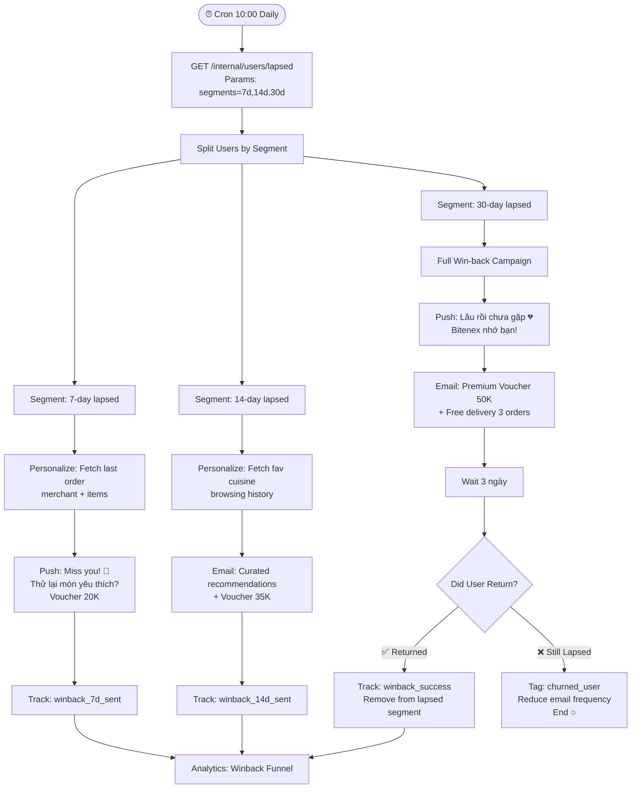

# 🚀 Bitenex — Customer Journey Tracking & Automation Platform

> **n8n Workflow Design Document**  
> Phiên bản: 1.0 | Ngày: 2026-03-29  
> Source of Truth: bitenex-api + bitenex-user

---

## 📐 Kiến trúc tổng thể



---

## 🗺️ Tổng quan 8 Workflows

| # | Workflow | Trigger | Kênh | Mục tiêu |
|---|----------|---------|------|----------|
| WF-01 | Onboarding → First Order | `user.registered` | Push, Email | Chuyển đổi người dùng mới → đơn đầu tiên |
| WF-02 | Abandoned Checkout Recovery | `checkout.abandoned` | Push, Email, SMS | Thu hồi checkout bị bỏ dở |
| WF-03 | Order Lifecycle Orchestration | `order.status_changed` | Push, In-App, WebSocket | Cập nhật realtime trạng thái đơn hàng |
| WF-04 | Delivered → Review + Reorder | `order.delivered` | Push, Email | Thu thập đánh giá + kích thích reorder |
| WF-05 | Driver Dispatch SLA Monitor | `dispatch.assigned` + Cron | Slack, Push | Giám sát SLA giao hàng, cảnh báo chậm trễ |
| WF-06 | Payment Failure Recovery | `payment.failed` | Push, Email, SMS | Khôi phục thanh toán thất bại |
| WF-07 | Merchant Daily Analytics Digest | Cron 08:00 | Email, Slack | Báo cáo doanh thu hàng ngày cho merchant |
| WF-08 | Win-back Lapsed Users | Cron daily | Push, Email | Re-engage người dùng không hoạt động |

---

## WF-01: Onboarding → First Order Journey

**Mục tiêu**: Hướng dẫn người dùng mới đặt đơn hàng đầu tiên trong vòng 24 giờ.

**Trigger**: Webhook `POST /webhook/bitenex/user-registered`



**Nodes sử dụng**:
- `Webhook` (trigger)
- `Set` (biến)
- `HTTP Request` (gọi API)
- `Send Email` (SMTP/SendGrid)
- `Wait` (delay)
- `IF` (điều kiện)
- `Code` (transform data)
- `Slack` (tracking log)

**Payload webhook mẫu**:
```json
{
  "userId": "user_abc123",
  "firstName": "Minh",
  "email": "minh@example.com",
  "phone": "+84901234567",
  "city": "HCM",
  "platform": "ios",
  "registeredAt": "2026-03-29T05:00:00Z"
}
```

---

## WF-02: Abandoned Checkout Recovery

**Mục tiêu**: Thu hồi các checkout bị bỏ dở trước khi thanh toán.

**Trigger**: Webhook `POST /webhook/bitenex/checkout-abandoned`



**Nodes sử dụng**:
- `Webhook`, `Set`, `IF`, `Switch`
- `HTTP Request` (cart status, voucher)
- `Send Email` (HTML template)
- `Twilio` (SMS)
- `Wait`
- `Merge` (kết hợp branches)

---

## WF-03: Order Lifecycle Orchestration

**Mục tiêu**: Tự động thông báo mỗi bước trong vòng đời đơn hàng, từ PENDING → DELIVERED.

**Trigger**: Webhook `POST /webhook/bitenex/order-status-changed`



**Nodes sử dụng**:
- `Webhook`, `Set`, `Switch`
- `HTTP Request` (push + in-app notification)
- `Code` (format message theo status)
- `Execute Workflow` (trigger WF-04 khi DELIVERED)

**Payload webhook mẫu**:
```json
{
  "orderId": "ord_xyz789",
  "orderNumber": "BX-2026-001234",
  "userId": "user_abc123",
  "merchantId": "merchant_456",
  "driverId": "driver_789",
  "fromStatus": "PREPARING",
  "toStatus": "READY",
  "total": 185000,
  "currency": "VND",
  "merchantName": "Bún Chả 36",
  "changedAt": "2026-03-29T06:30:00Z"
}
```

---

## WF-04: Delivered → Review + Reorder

**Mục tiêu**: Sau giao hàng thành công, thu thập đánh giá (driver + food) và khuyến khích reorder.

**Trigger**: Webhook `POST /webhook/bitenex/order-delivered` hoặc Execute từ WF-03



**Nodes sử dụng**:
- `Webhook`, `Set`, `Wait`, `IF`
- `HTTP Request` (review status, voucher API)
- `Send Email` (review request template)
- `Slack` (negative feedback alert)
- `Code` (calculate rating average)

---

## WF-05: Driver Dispatch & SLA Monitor

**Mục tiêu**: Giám sát thời gian giao hàng, cảnh báo chậm trễ, và tự động leo thang vấn đề.

**Trigger**: Webhook `POST /webhook/bitenex/dispatch-assigned` + Cron mỗi 5 phút



**Nodes sử dụng**:
- `Webhook` (initial capture)
- `Schedule Trigger` (cron)
- `HTTP Request` (active deliveries)
- `Split In Batches` (loop orders)
- `Code` (SLA calculation)
- `IF`, `Switch` (thresholds)
- `Slack` (ops alerts)
- `Postgres` (store SLA records)

---

## WF-06: Payment Failure Recovery

**Mục tiêu**: Phục hồi thanh toán thất bại và giúp user hoàn tất đơn hàng.

**Trigger**: Webhook `POST /webhook/bitenex/payment-failed`



**Nodes sử dụng**:
- `Webhook`, `Set`, `Switch`
- `HTTP Request` (payment status, cancel order)
- `Send Email`, `Twilio SMS`
- `Wait`, `IF`
- `Slack` (ops notification for failed payments)

---

## WF-07: Merchant Daily Analytics Digest

**Mục tiêu**: Gửi báo cáo doanh thu + hiệu suất hàng ngày cho từng merchant vào 8:00 sáng.

**Trigger**: Cron `0 8 * * *` (08:00 mỗi ngày)



**Nodes sử dụng**:
- `Schedule Trigger` (cron)
- `HTTP Request` (active merchants, stats)
- `Split In Batches` (pagination)
- `Code` (report formatting, calculations)
- `IF`, `Switch` (thresholds)
- `Send Email` (HTML report)
- `Slack` (ops alerts)

---

## WF-08: Win-back Lapsed Users

**Mục tiêu**: Re-engage người dùng không hoạt động trong 7, 14, và 30 ngày.

**Trigger**: Cron `0 10 * * *` (10:00 sáng mỗi ngày)



**Nodes sử dụng**:
- `Schedule Trigger`
- `HTTP Request` (lapsed users, last orders, preferences)
- `Split In Batches`
- `Code` (personalization logic)
- `Send Email` (curated HTML)
- `IF`, `Switch`
- `Wait`
- `Merge`

---

## 🔧 Môi trường & Biến

### n8n Environment Variables

```bash
# Bitenex API
BITENEX_API_BASE_URL=https://api.bitenex.vn
BITENEX_INTERNAL_API_KEY=your-internal-key

# Email
SMTP_HOST=smtp.sendgrid.net
SMTP_PORT=587
SMTP_USER=apikey
SMTP_PASS=SG.xxxx

# SMS
TWILIO_ACCOUNT_SID=ACxxx
TWILIO_AUTH_TOKEN=xxx
TWILIO_FROM_NUMBER=+1234567890

# Slack
SLACK_BOT_TOKEN=xoxb-xxx
SLACK_OPS_CHANNEL=#bitenex-ops

# Analytics
MIXPANEL_TOKEN=xxx
```

### Internal API Endpoints (cần implement)

| Endpoint | Method | Mô tả |
|----------|--------|-------|
| `/internal/journeys/users/:id/first-order-status` | GET | Kiểm tra đơn đầu tiên |
| `/internal/journeys/checkouts/:id/status` | GET | Trạng thái checkout |
| `/internal/journeys/orders/:id/review-status` | GET | Trạng thái review |
| `/internal/journeys/users/:id/reorder-status` | GET | Trạng thái reorder |
| `/internal/notifications/push` | POST | Gửi push notification |
| `/internal/notifications/in-app` | POST | Lưu in-app notification |
| `/internal/marketing/issue-voucher` | POST | Phát voucher |
| `/internal/events/track` | POST | Track analytics event |
| `/internal/orders/active-deliveries` | GET | Đơn đang giao |
| `/internal/merchants/active-list` | GET | Danh sách merchant |
| `/internal/merchants/:id/daily-stats` | GET | Stats ngày hôm qua |
| `/internal/users/lapsed` | GET | Users không hoạt động |

---

## 📋 Checklist Triển khai

- [ ] Deploy n8n instance (Docker recommended)
- [ ] Cấu hình tất cả Environment Variables
- [ ] Import 8 workflow JSON files
- [ ] Implement các internal endpoints trong bitenex-api
- [ ] Test từng webhook với payload mẫu
- [ ] Cấu hình Webhook URLs trong bitenex-api (publish events)
- [ ] Review retry policy & error handling
- [ ] Cấu hình rate limiting cho notification channels
- [ ] Dedup event mechanism (dùng `WebhookEvent` table)
- [ ] Monitoring: Set up n8n error alerts → Slack

---

## 🔒 Security Notes

- Tất cả webhook endpoints nên dùng **HMAC signature validation**
- Internal API dùng **API Key auth** (không expose public)
- n8n không lưu trữ payment data (PCI compliance)
- Rate limit notification: max 3 push/ngày/user
